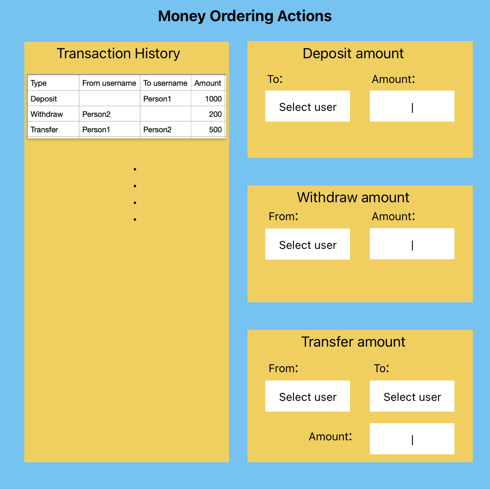

# Bank Management API

A Spring Boot application providing REST APIs for bank management operations where managers can perform transactions like deposits, withdrawals, and fund transfers for account users.

## Database Schema

### Tables Structure
- **Users**: Stores user information (id, first_name, last_name, email, role, created_at, updated_at)
- **Accounts**: Maintains account details (id, account_number, user_id, created_at, updated_at)
- **Transactions**: Records all transactions (id, from_account_id, to_account_id, amount, created_at, updated_at)

## Features

### Core Features
Create a simple Springboot apis for bank management application where Manager can perform "Deposit", "Withdraw" and "Fund transfer" for account users. DB schema is already provided. Please understand the given schema, make necessary changes if require and create apis to fulfill below requirements.

- Manager can Deposit amount to a particular user's account.
- Manager can Withdraw amount from a particular user's account.
- Manager can transfer amount from one user to another user's account.
- Manager should be able to fetch history of all the transactions he performed.

### Add-ons:
- Add cronjob which sends particular user's 24 hours' statement once a day via email.


## Technologies Used

- Java 17
- Spring Boot 3.5.3
- SQLite Database
- Gradle (Kotlin DSL)
- Spring Data JPA
- Spring Web

## Building and Running the Application

### Steps to Run

1. Clone the repository
```bash
git clone <repository-url>
```

2. Navigate to project directory
```bash
cd bank-management-api
```

3. Build the project
```bash
./gradlew build
```

4. Run the application
```bash
./gradlew bootRun
```

The application will start running on `http://localhost:8080`

